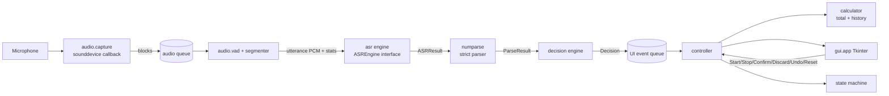

# Architecture — Voice Calculator

> Doc role: **HOW** the system is intended to work. Requirements: `prd.md`. Constraints on the coding agent: `rules.md`. Build order: `phases.md`. UI: `design.md`.
>
> **IMPORTANT:** Model selection, VAD choice, and all numeric thresholds in this document are **experimental hypotheses** until validated on representative recordings (`research.md`). Nothing here is a measured result. Items tagged **[BENCH]** must wait for benchmark evidence.

Labels: **FIXED**, **DEFAULT** (starting choice), **PROVISIONAL**, **OPEN**, **[BENCH]**.

---

## 1. Architecture Overview

A single-process Python desktop app with three execution contexts:

1. **GUI thread** (Tkinter main thread): rendering and user actions only.
2. **Audio capture callback** (sounddevice's thread): copies audio blocks into a queue. Does nothing else.
3. **Worker thread** ("pipeline worker"): VAD, segmentation, ASR, parsing, decision. Posts results to the GUI via a thread-safe queue.

Principle: **audio → text is probabilistic; text → number → total is deterministic.** Only the ASR step is probabilistic, and its output is never trusted without parse + validation. Modular but small: plain modules and small classes, no plugin frameworks, no dependency injection containers.

## 2. Component Diagram



Text version:
```
Mic -> capture(cb) -> audio_queue -> [worker: VAD/segment -> ASR -> parse -> validate/decide]
    -> ui_queue -> controller -> (calculator, state) -> GUI
GUI buttons -> controller -> (state, calculator, worker start/stop)
```

## 3. End-to-End Data Flow

1. User presses **Start** → controller validates state, starts capture + worker.
2. Capture callback pushes fixed-size PCM blocks (DEFAULT 16 kHz, mono, int16, 20–30 ms blocks) to `audio_queue`.
3. Worker feeds blocks to VAD; segmenter builds an **utterance** (pre-roll + speech + short trailing silence).
4. Utterance (PCM + stats: duration, peak, RMS, clipping flag) → `ASREngine.transcribe()` → `ASRResult(text, optional confidence, engine id, timings)`.
5. Text → `numparse.parse()` → `ParseResult(value | rejection reason)`.
6. `decision.decide()` combines parse result, utterance stats, and ASR signals → `Decision(ACCEPT | CONFIRM | REJECT, value, reason)`.
7. Worker posts event to `ui_queue`. Controller (on GUI thread) applies it: ACCEPT → `calculator.add()`; CONFIRM → state `AWAITING_CONFIRMATION`; REJECT → message only.
8. GUI updates total, status, last value, history.

The calculator is only ever mutated on the GUI/controller thread, so no locks around the total are needed.

## 4. Module Responsibilities

Proposed layout (DEFAULT; create modules only when their phase begins):

```
src/voice_calculator/
  config.py          # constants & tunables (sample rate, thresholds, timeouts) - single source
  numparse.py        # strict number-word parser (pure functions, no I/O)
  asr/
    base.py          # ASREngine protocol, ASRResult dataclass
    vosk_engine.py   # candidate A (constrained grammar)
    whisper_engine.py# candidate B (faster-whisper), added only if benchmark phase needs it
  audio/
    capture.py       # microphone stream, device errors, queue push
    vad.py           # VAD wrapper (energy baseline; Silero optional) [BENCH]
    segmenter.py     # frames -> utterances
    wavio.py         # read/write WAV for benchmark tooling
  decision.py        # ACCEPT / CONFIRM / REJECT policy (pure function)
  calculator.py      # running total, history, undo, reset (pure, no I/O)
  state.py           # state enum + transition table
  controller.py      # glue: GUI events <-> worker <-> calculator
  logging_setup.py   # local logging, privacy-safe defaults
  gui/app.py         # Tkinter window (no business logic)
  gui/messages.py    # all user-facing text (single source, matches design.md §7)
tools/
  benchmark.py       # offline benchmark over a local labeled recordings folder
  record_dataset.py  # guided recording helper (writes to git-ignored data/)
tests/               # pytest; mirrors modules
data/                # git-ignored: recordings, labels, results
models/              # git-ignored: ASR model files
```

Rules of responsibility: `numparse`, `decision`, `calculator`, `state` are **pure** (no threads, no I/O, no GUI imports) so they are fully unit-testable. `gui/` contains no parsing, arithmetic, or decision logic. No module other than `config.py` defines tunable constants.

## 5. Audio Pipeline

- **Capture (FIXED):** sounddevice `InputStream` with callback; callback only copies and enqueues; queue is bounded (DEFAULT ~10 s of audio); on overflow, drop-oldest is **not** allowed during an utterance — instead flag the utterance as `damaged` so the decision engine REJECTs it.
- **Format (DEFAULT):** 16 kHz, mono, 16-bit PCM (matches Vosk and Whisper input needs; resample if device refuses).
- **VAD [BENCH]:** start with a simple energy-threshold VAD with hangover (no extra dependency). Evaluate Silero VAD against it in Phase 4 using `research.md` VAD template; adopt Silero only if it measurably reduces missed/clipped utterances or false triggers. Note: the `silero-vad` PyPI package pulls PyTorch (large); an ONNX-runtime-based route is preferred if adopted, and its size cost must be justified.
- **Segmentation (DEFAULT values, all [BENCH]):** pre-roll 200–300 ms; end-of-speech hangover ~700 ms; min utterance ~250 ms; max utterance ~6 s (longer → REJECT as `TOO_LONG`).
- **Utterance stats** computed deterministically: duration, peak, RMS, clipping flag (samples at full scale), damaged flag.
- **Stop:** `Stop` ends capture immediately; any in-progress utterance is **discarded**, not recognized (avoids surprise additions after Stop). Pending queue items are dropped.
- **Back-pressure:** one utterance is processed at a time; while processing, new audio still queues (bounded) and the next utterance is handled afterward. While `AWAITING_CONFIRMATION`, listening is **suspended** (capture may stay open but audio is discarded) until the user acts.

## 6. State Machine

States: `IDLE`, `STARTING`, `LISTENING`, `HEARING` (speech detected), `PROCESSING`, `AWAITING_CONFIRMATION`, `STOPPING`, `ERROR`.

| From | Event | To | Notes |
|------|-------|----|-------|
| IDLE | Start pressed | STARTING | Start allowed only if models loaded |
| STARTING | stream opened | LISTENING | |
| STARTING | device/model error | ERROR | |
| LISTENING | VAD speech start | HEARING | |
| HEARING | VAD speech end | PROCESSING | |
| HEARING | utterance too long / damaged | LISTENING | emits REJECT |
| PROCESSING | Decision ACCEPT | LISTENING | total updated |
| PROCESSING | Decision REJECT | LISTENING | message shown |
| PROCESSING | Decision CONFIRM | AWAITING_CONFIRMATION | listening suspended |
| PROCESSING | ASR exception | LISTENING | or ERROR after N consecutive failures |
| AWAITING_CONFIRMATION | Add (confirm) | LISTENING | add value; resume listening |
| AWAITING_CONFIRMATION | Discard | LISTENING | nothing added |
| AWAITING_CONFIRMATION | Stop pressed | IDLE (via STOPPING) | pending value discarded |
| LISTENING / HEARING / PROCESSING | Stop pressed | STOPPING → IDLE | in-flight result discarded |
| any listening state | mic lost | ERROR | total/history kept |
| ERROR | Start pressed | STARTING | retry |
| IDLE / ERROR | Undo / Reset | same | allowed in any state except mid-transition |

Any (state, event) pair not in this table is invalid: the controller ignores it and logs it at debug level; it must never crash. Undo and Reset are allowed in every state, but while `AWAITING_CONFIRMATION` Undo is disabled (to avoid ambiguity about what is undone); Reset is allowed and clears the pending item.

## 7. ASR Abstraction and Candidate Strategy

```
class ASREngine (protocol):
    name: str
    def load() -> None
    def transcribe(pcm: bytes|ndarray, sample_rate: int) -> ASRResult
class ASRResult: text: str, confidence: float|None, alternatives: list[str], engine: str, elapsed_ms: float
```

The interface is the only coupling between recognition and the rest of the app. `confidence` is optional and is **only a weak input signal** (never proof of correctness).

| Candidate | Strengths (hypotheses) | Risks (hypotheses) |
|-----------|------------------------|--------------------|
| **A. Vosk small English + constrained grammar of number words** | Small, fast, offline, grammar limits outputs to number words | Grammar-constrained decoders can force a wrong in-grammar answer on noise; accent sensitivity |
| **B. faster-whisper (`tiny.en` / `base.en` / `small.en`, CPU int8)** | Often robust to accents/noise; good number-word output | Larger/slower; free-form text (hallucinations on silence); digit/word format variance; no hard grammar |
| **C. Hybrid (A primary, B only when needed or as cross-check)** | Agreement between independent engines is a measurable validation signal | Complexity, latency, memory; **not assumed necessary** |

**Current recommendation (DEFAULT, not a decision):** implement candidate A as the Phase 2 baseline. Phase 3 benchmarks A and B (and C as an *offline* agreement analysis) on the same recordings, then records an ADR. Adding B or C to the app, or fine-tuning anything, is allowed only after that ADR **[BENCH]**.

## 8. Number Parser and Validation Design

- `numparse.parse(text: str) -> ParseResult` — pure, deterministic, no ML. Authoritative specification of accepted/rejected forms: `prd.md` §7.
- **Pipeline:**
  1. **Normalize:** Strip leading/trailing whitespace. If empty → `EMPTY`. Lowercase text. Convert hyphens to spaces (`forty-five` → `forty five`). Strip harmless sentence-final punctuation (`.`, `?`, `!`) only if trailing; reject on internal punctuation (e.g. `15.0`, `1,500`). Collapse whitespace.
  2. **Canonical Digit Check:** If the string is pure ASCII digits, validate canonical integer format (no leading zeros except `0`, range 0–2000). Reject with `OUT_OF_RANGE` if >2000, `MALFORMED` if non-canonical (e.g. `007`).
  3. **Tokenize:** Tokenize against closed vocabulary. Any unrecognized token (e.g. `hello`, `undo`, `dollars`) → `NOT_A_NUMBER`. Decimals/negatives/fractions → `UNSUPPORTED`.
  4. **Grammar Parse:** Evaluate against deterministic English number grammar:
     - `zero` → 0
     - `below100`: `1..19` or `tens` (20..90) or `tens + unit` (21..99).
     - `hundreds`: `(one|two|...|nine|a) hundred [ [and] below100 ]`
     - `teen_hundreds`: `(eleven|twelve|...|nineteen) hundred [ [and] below100 ]`
     - `thousands`: `(one|a) thousand [ [and] (one|two|...|nine) hundred ] [ [and] below100 ]` or `(one|a) thousand [and] below100` or `two thousand`
     - Grammatically valid numerical phrases evaluating to >2000 (e.g. `two thousand and one`, `three thousand`) evaluate to integer and then return `OUT_OF_RANGE`.
     - Structural violations (e.g. `ten hundred`, `hundred`, `thousand`, `forty and five`, `hundred and`) → `MALFORMED`.
     - Disconnected / ambiguous readings (`twenty twenty`, `fifteen fifty`, `one two three`) → `AMBIGUOUS` / `MULTIPLE_NUMBERS`.
- **Reason codes:** `EMPTY`, `NOT_A_NUMBER`, `OUT_OF_RANGE`, `UNSUPPORTED`, `MALFORMED`, `AMBIGUOUS`, `MULTIPLE_NUMBERS`.
- **Invariants:** Pure function, no I/O, no network, no unhandled exceptions on arbitrary input.
- **Tests:** Exhaustive generation of canonical word forms for 0–2000 (round trip), linguistic variants ("a" forms, optional "and", teen-hundreds), boundary values, comprehensive rejection corpus, and invariant/fuzz tests.

## 9. Decision Engine (ACCEPT / CONFIRM / REJECT)

Pure function: `decide(parse_result, utterance_stats, asr_signals, config) -> Decision`.

Hard rules (**FIXED**, independent of thresholds):
1. Parse failed → **REJECT**.
2. Utterance flagged damaged / too long / too short / clipped / empty → **REJECT**.
3. Parsed value `0` → **CONFIRM** (DEFAULT).
4. Any rule evaluating "uncertain" → **CONFIRM** (never ACCEPT).
5. ASR confidence alone never triggers ACCEPT.

Soft signals (all thresholds **[BENCH]**, no invented values): utterance duration plausibility for the parsed word count, signal level (too quiet), engine-vs-engine agreement (only if a second pass exists), n-best disagreement, ASR confidence as a weak negative signal (low → downgrade to CONFIRM; high never upgrades by itself).

**Safe default policy until calibrated (DEFAULT):** `auto_accept_enabled = false` → every successfully parsed value is **CONFIRM**. Phase 5 introduces auto-accept rules only if `research.md` calibration shows the False Addition Rate target (`prd.md` AC-4) is met on a held-out set. This guarantees the system is safe-by-default before evidence exists.

Decision output includes a `reason` string for the UI/log (e.g. `PARSE_FAILED:MALFORMED`, `ZERO_VALUE`, `LOW_SIGNAL`).

## 10. Deterministic Calculation Core

- `Calculator`: `total: int`, `entries: list[Entry]` (value, timestamp, outcome).
- Operations: `add(value)` (0 ≤ value ≤ 2000 enforced), `undo()` (removes last added entry; returns it or None), `reset()`, `total` always **derived from** the entries (sum of non-undone added entries) or asserted equal to it in tests — no independent mutable total that can drift.
- Python `int` (no floats). Non-added events (rejected/discarded) are stored in a separate display log, not in `entries`.
- No I/O, no threading, no GUI imports.

## 11. GUI and Threading Model

- Tkinter (stdlib; no dependency). Main thread owns all widgets.
- Worker→GUI communication only through a `queue.Queue` polled with `root.after(50, poll)` (DEFAULT 50 ms). Never call Tk methods from other threads.
- GUI→worker: controller sets thread-safe flags/events (start, stop). Stop must return quickly; joining the worker uses a timeout and never blocks the GUI.
- Models load in a background thread at app launch; Start is disabled with "Loading…" until ready.
- Layout and behavior: `design.md`.

## 12. Error Handling and Recovery

- Errors are typed (`MicNotFound`, `MicLost`, `ModelMissing`, `ModelLoadFailed`, `RecognitionFailed`, `InternalError`) and mapped to plain-language messages in one table (`design.md` §7; requirements `prd.md` §9).
- Worker catches exceptions per utterance; one failure never kills the app. N consecutive failures (DEFAULT 5) → `ERROR`.
- On any error, calculator state is untouched.
- Global exception hook shows a generic message and logs the traceback locally.

## 13. Local Logging and Privacy

- Python `logging` to a rotating file in a local, git-ignored directory (DEFAULT `logs/`; packaged app: user's local app-data folder).
- Default log content: state transitions, error types, timings. **No audio, no transcripts, no numeric values.**
- Debug mode (explicit setting, visibly indicated in UI): transcripts, parsed values, decisions. Optional utterance recording for benchmarking only via `tools/record_dataset.py` or an explicit debug flag, saved to `data/`.
- No network code anywhere. If a library attempts downloads (e.g., model auto-download), pin to local model paths and disable auto-download.

## 14. Packaging Approach

- Only after Phase 7 integration and Phase 8 reliability tests pass.
- Candidate: PyInstaller (**one-folder** build first; one-file only if startup time is acceptable) [BENCH on startup].
- Models shipped in an app subfolder, not committed to Git; build script documents how to place them.
- Verify packaged build: offline run, microphone access prompt, antivirus false-positive check, startup time. Installer is a future enhancement.

## 15. Key Technical Risks

| Risk | Mitigation |
|------|-----------|
| ASR substitutes a plausible wrong number (e.g., 15 vs 50) | Strict parser, decision engine, confirm-by-default, False Addition Rate benchmark |
| Grammar-constrained ASR forces in-grammar output on noise | Utterance stats checks, benchmark with non-number/noise clips |
| Whisper hallucination on silence/noise | VAD gating, min duration/level checks, parser rejects non-numbers |
| "fifteen" vs "fifty" confusion | Benchmark specifically on teen/ty pairs; CONFIRM policy |
| VAD clips word starts/ends | Pre-roll and hangover tuning; VAD experiments |
| Latency too high for small models on user's CPU | Measure early (Phase 2–3); pick smaller model |
| GUI freeze | Strict thread separation; test for event-loop stalls |
| Windows mic permission/driver issues | Explicit error mapping; manual test matrix |
| Packaging size/AV false positives | Defer packaging; one-folder build; test early in Phase 8 |
| Scope creep by coding agent | `rules.md`, phase gates |

## 16. Decisions Requiring Benchmark Evidence [BENCH]

- Which ASR engine (A, B, or hybrid C) and model size.
- Whether any second-pass/agreement check is worth its cost.
- VAD choice (energy vs Silero) and all segmentation timings.
- Any auto-accept rule and its thresholds (default: none; confirm-all).
- Whether ASR confidence is useful as a signal at all.
- Whether fine-tuning is considered (only if confirm rate is unacceptable and data supports it).
- Packaging mode (one-folder vs one-file).

## 17. Dependency Policy and Candidates

| Package | Purpose | Status |
|---------|---------|--------|
| Python 3.11+ (DEFAULT; confirm in Phase 0) | runtime | DEFAULT |
| tkinter | GUI | stdlib, DEFAULT |
| sounddevice (+ numpy) | mic capture, array ops | DEFAULT, justified: simplest reliable Windows capture |
| vosk | candidate ASR A | DEFAULT for Phase 2 baseline |
| faster-whisper | candidate ASR B | added in Phase 3 only |
| silero-vad (or ONNX runtime route) | candidate VAD | evaluated in Phase 4 only |
| pytest | tests | DEFAULT |
| ruff (optional) | lint/format | optional |
| pyinstaller | packaging | Phase 8 only |

Every new dependency requires a justification entry in `memory.md` (see `rules.md`).
